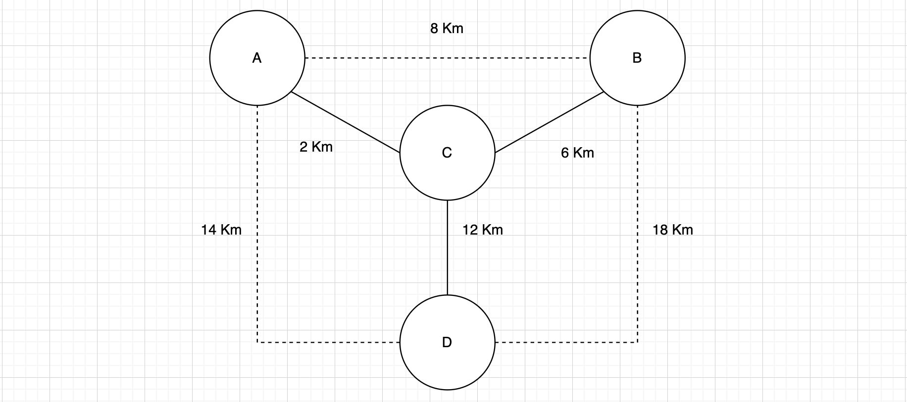
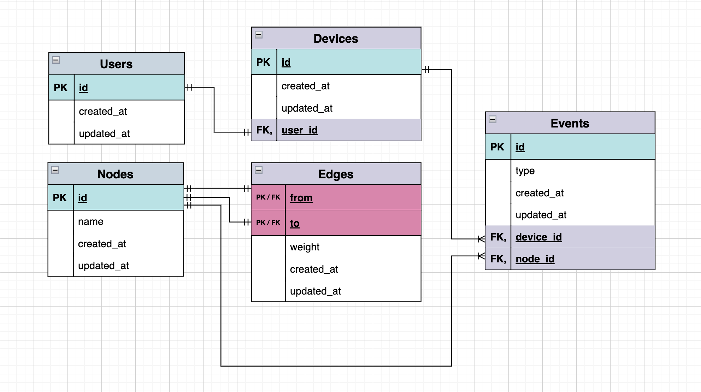

# Motorway challenge

The challenge can be found in the `docs` folder.

## Notes:

- No authentication in place (`OAuth 2.0` standard using `grant_type=client_credentials` would be a good fit)
- Drivers will always prefer the shortest path to go from A to B (using `Dijkstra` algorithm)
- One Device per Driver
- Fixed cost per Km
- The **BillModule** which computes the cost of the travels for a specific user in a specific period is integreted in the same server. It would be better to have it as a standalone application which can be separately deployed, eventually scheduled and horizontally scaled

## Migration network sample



The following data is available at `t0` in order to play with **Postman** as suggested in the next sections:

- DeviceId: `e3ab8c16-78ef-47db-8e4f-d0173126ffe0`
- NodeAId: `6cacc7e2-7f71-4240-a4d0-dddb189338df`
- NodeBId: `76310119-0623-41e8-bb88-4a4e1597ce03`
- NodeCId: `1f8642d8-7252-431d-b209-87ff535c692a`
- NodeDId: `d43d0c98-9f68-4809-be85-2c36f7517aa3`

## ER diagram



## Out of the Box

### Requirements

- [Docker](https://www.docker.com/)

### Quickstart

```bash
$ docker compose -f docker-compose.runner.yml up
```

- Add `-d` to start all containers in detached mode (you won't see any logs).
- Add `--build` to rebuild the Docker image used by the docker compose.

Visit [http://localhost:3000/swagger](http://localhost:3000/swagger/) for APIs documentation (host and port according to environment variables).

In order to run also the tests without having `Node.Js` on your local machine:

```bash
$ docker compose -f docker-compose.tester.yml up
```

## Postman

Once the server is running, play with the APIs using [Postman](https://www.postman.com/downloads/). All you have to do is:

- [create a workspace](https://learning.postman.com/docs/collaborating-in-postman/using-workspaces/creating-workspaces/) (e.g. Motorway)
- [import data](https://learning.postman.com/docs/getting-started/importing-and-exporting-data/#importing-data-into-postman) from the `./postman` folder

Hope you have fun!

## Development

### Requirements

- [Node.Js](https://nodejs.org) >= v16.0.0
- [Docker](https://www.docker.com/)

### Quickstart

```bash
$ npm install
$ cp env/.env.development .env
$ docker compose up --remove-orphans
$ npm run start:dev
```

- `--remove-orphans` will eventually remove orphan containers created during the "Out of the Box" section

In order to create a new `migration`:

```bash
$ npx typeorm migration:create -n MigrationName -d src/migrations/development
```

### Test

```bash
$ docker compose -f docker-compose.test.yml up --remove-orphans
$ npm run test
```

### Environment variables

#### Environment

- `NODE_ENV`

Required: _true_ \
Description: node environment. \
Values: [`development`, `production`, `test`]

#### Server

- `HOST`

Required: _false_ \
Description: domain name of the network host or its IP address.

- `PORT`

Required: _true_ \
Description: port number to connect to.

#### Logger

- `LOGGER_LEVEL`

Required: _true_ \
Description: console logger level. \
Values: [`silent`, `error`, `warn`, `info`, `http`, `verbose`, `debug`]

- `LOGGER_PRETTY`

Required: _false_ \
Description: boolean to enable/disable logs formatting.

- `LOGGER_REDACT`

Required: _false_ \
Description: string of keys separated by comma that hold sensitive data to hide in the log output.

#### Database

- `DB_HOST`

Required: _true_ \
Description: domain name of the database host or its IP address.

- `DB_PORT`

Required: _true_ \
Description: port number to connect to the database.

- `DB_DATABASE`

Required: _true_ \
Description: database name.

- `DB_SCHEMA`

Required: _false_ \
Default: `public` \
Description: database schema.

- `DB_MIGRATIONS_FOLDER`

Required: _true_ \
Description: migration folder name.

- `DB_USERNAME`

Required: _true_ \
Description: database username.

- `DB_SSL_ENABLED`

Required: _true_ \
Description: database SSL connection.

- `DB_PASSWORD`

Required: only when `DB_SSL_ENABLED` is _false_ \
Description: database password.

- `DB_SSL_CA`

Required: only when `DB_SSL_ENABLED` is _true_ \
Description: database SSL ca.

- `DB_SSL_CERT`

Required: only when `DB_SSL_ENABLED` is _true_ \
Description: database SSL cert.

- `DB_SSL_KEY`

Required: only when `DB_SSL_ENABLED` is _true_ \
Description: database SSL key.
